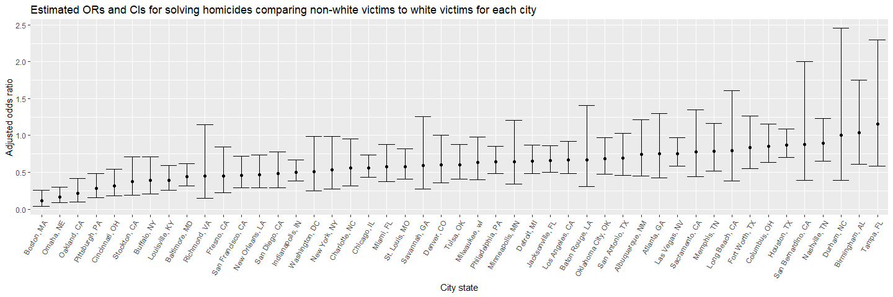

p8105\_hw6\_yh3094
================
Yun He
November 16, 2018

Problem 1
=========

``` r
homicide_data = 
  GET("https://raw.githubusercontent.com/washingtonpost/data-homicides/master/homicide-data.csv") %>% 
  content("raw") %>% 
  read_csv()
```

Clean the data
--------------

``` r
homicide_data = homicide_data %>% 
  mutate(
    city_state = str_c(city, state, sep = ", "),
    resolved = as.numeric(disposition == "Closed by arrest")) %>% 
  filter(!(city_state %in% c("Dallas, TX", "Phoenix, AZ", "Kansas City, MO", "Tulsa, AL"))) %>% 
  mutate(
    victim_race = ifelse(victim_race == "White", "white", "non-white"),
    victim_race = fct_relevel(victim_race, "white"),
    victim_age = as.numeric(victim_age))
```

Analyze the city of Baltimore, MD
---------------------------------

Obtain the estimate and confidence interval of the adjusted odds ratio for solving homicides comparing non-white victims to white victims keeping all other variables fixed.

``` r
baltimore = homicide_data %>% 
  filter(city_state == "Baltimore, MD") %>% 
  glm(resolved~victim_age + victim_sex + victim_race, data = .,family = binomial())

estimate = baltimore %>% 
  broom::tidy() %>% 
  mutate(OR = exp(estimate)) %>% 
  select(term, OR)
confint = baltimore %>% 
  broom::confint_tidy() %>% 
  mutate(conf_low = exp(conf.low),
         conf_high = exp(conf.high)) %>% 
  select(conf_low, conf_high)
bind_cols(estimate, confint) %>% 
  filter(term == "victim_racenon-white") %>% 
  select(-term) %>% 
  mutate(city_state = "Baltimore, MD") %>% 
  select(city_state, everything()) %>% 
  knitr::kable(digits = 3)
```

| city\_state   |     OR|  conf\_low|  conf\_high|
|:--------------|------:|----------:|-----------:|
| Baltimore, MD |  0.441|      0.312|        0.62|

Analyze each of the cities in the dataset
-----------------------------------------

``` r
estimate_conf = function(glm_result){
  estimate =  broom::tidy(glm_result) %>% 
    mutate(OR = exp(estimate)) %>% 
    select(term, OR)
  
  confint =  broom::confint_tidy(glm_result) %>% 
    mutate(conf_low = exp(conf.low),
         conf_high = exp(conf.high)) %>% 
    select(conf_low, conf_high)
  
  OR_conf = bind_cols(estimate, confint) %>% 
    filter(term == "victim_racenon-white")
  
  return(OR_conf)
}

total_result = homicide_data %>% 
  select(city_state, victim_age, victim_race, victim_sex, resolved) %>% 
  group_by(city_state) %>% 
  nest() %>% 
  mutate(
    glm_result = map(data, ~glm(resolved~victim_age + victim_sex + victim_race, data = .x, family = binomial()))) %>%
  mutate(OR = map(glm_result, estimate_conf)) %>% 
  select(city_state, OR) %>% 
  unnest() %>% 
  select(-term)

knitr::kable(total_result, digits = 3)
```

| city\_state        |     OR|  conf\_low|  conf\_high|
|:-------------------|------:|----------:|-----------:|
| Albuquerque, NM    |  0.741|      0.449|       1.215|
| Atlanta, GA        |  0.753|      0.424|       1.299|
| Baltimore, MD      |  0.441|      0.312|       0.620|
| Baton Rouge, LA    |  0.668|      0.304|       1.405|
| Birmingham, AL     |  1.039|      0.612|       1.754|
| Boston, MA         |  0.115|      0.043|       0.259|
| Buffalo, NY        |  0.390|      0.210|       0.710|
| Charlotte, NC      |  0.558|      0.313|       0.951|
| Chicago, IL        |  0.562|      0.432|       0.734|
| Cincinnati, OH     |  0.318|      0.180|       0.541|
| Columbus, OH       |  0.855|      0.634|       1.153|
| Denver, CO         |  0.602|      0.358|       1.008|
| Detroit, MI        |  0.651|      0.487|       0.869|
| Durham, NC         |  1.003|      0.390|       2.452|
| Fort Worth, TX     |  0.838|      0.553|       1.264|
| Fresno, CA         |  0.448|      0.222|       0.846|
| Houston, TX        |  0.873|      0.698|       1.090|
| Indianapolis, IN   |  0.505|      0.381|       0.665|
| Jacksonville, FL   |  0.658|      0.502|       0.862|
| Las Vegas, NV      |  0.755|      0.586|       0.972|
| Long Beach, CA     |  0.794|      0.379|       1.606|
| Los Angeles, CA    |  0.666|      0.481|       0.916|
| Louisville, KY     |  0.392|      0.257|       0.590|
| Memphis, TN        |  0.782|      0.519|       1.160|
| Miami, FL          |  0.576|      0.377|       0.881|
| Milwaukee, wI      |  0.632|      0.398|       0.982|
| Minneapolis, MN    |  0.646|      0.341|       1.204|
| Nashville, TN      |  0.899|      0.652|       1.234|
| New Orleans, LA    |  0.466|      0.294|       0.737|
| New York, NY       |  0.531|      0.271|       0.988|
| Oakland, CA        |  0.213|      0.099|       0.418|
| Oklahoma City, OK  |  0.681|      0.477|       0.970|
| Omaha, NE          |  0.169|      0.091|       0.298|
| Philadelphia, PA   |  0.644|      0.485|       0.850|
| Pittsburgh, PA     |  0.282|      0.157|       0.485|
| Richmond, VA       |  0.447|      0.144|       1.150|
| San Antonio, TX    |  0.689|      0.459|       1.026|
| Sacramento, CA     |  0.781|      0.443|       1.348|
| Savannah, GA       |  0.596|      0.275|       1.258|
| San Bernardino, CA |  0.880|      0.394|       1.999|
| San Diego, CA      |  0.483|      0.294|       0.778|
| San Francisco, CA  |  0.458|      0.288|       0.719|
| St. Louis, MO      |  0.577|      0.405|       0.819|
| Stockton, CA       |  0.376|      0.193|       0.713|
| Tampa, FL          |  1.159|      0.585|       2.293|
| Tulsa, OK          |  0.602|      0.411|       0.876|
| Washington, DC     |  0.510|      0.250|       0.989|

Create a plot that shows the estimated ORs and CIs for each city
----------------------------------------------------------------

``` r
total_result %>%
  mutate(city_state = fct_reorder(city_state, OR)) %>% 
  ggplot(aes(x = city_state, y = OR)) +
  geom_point() +
  geom_errorbar(aes(ymin = conf_low, ymax = conf_high)) +
  theme(axis.text.x = element_text(angle = 60, hjust = 1)) +
  labs(title = "Estimated ORs and CIs for solving homicides comparing non-white victims to white victims for each city",
       y = "Adjusted odds ratio",
       x = "City state")
```



After adjusting for age, sex and race in the glm model, the estimated ORs for solving homicides comparing non-white victims to white victims for all cities are below 1, which means that homicides of non-white victims are less likely to be solved than those of white victims. The results are statistically significant in most cities. Boston, MA had the smallest adjusted odds ratio for solving homicides comparing non-white victims to white victims, and Tampa, FL had the largest adjusted odds ratio.

Problem 2
=========
