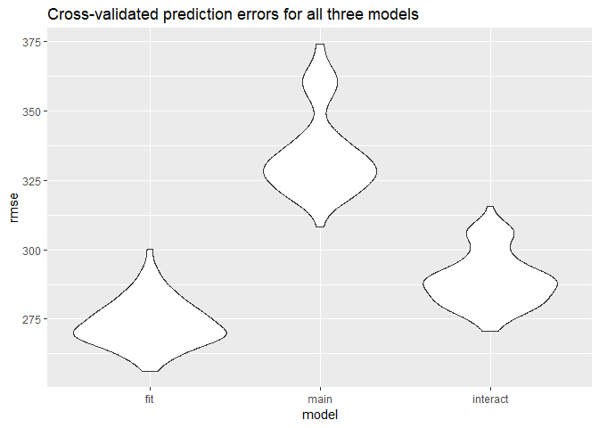

p8105\_hw6\_yh3094
================
Yun He
November 16, 2018

Problem 1
=========

``` r
homicide_data = 
  GET("https://raw.githubusercontent.com/washingtonpost/data-homicides/master/homicide-data.csv") %>% 
  content("raw") %>% 
  read_csv()
```

Clean the data
--------------

``` r
homicide_data = homicide_data %>% 
  mutate(
    city_state = str_c(city, state, sep = ", "),
    resolved = as.numeric(disposition == "Closed by arrest")) %>% 
  filter(!(city_state %in% c("Dallas, TX", "Phoenix, AZ", "Kansas City, MO", "Tulsa, AL"))) %>% 
  mutate(
    victim_race = ifelse(victim_race == "White", "white", "non-white"),
    victim_race = fct_relevel(victim_race, "white"),
    victim_age = as.numeric(victim_age))
```

Analyze the city of Baltimore, MD
---------------------------------

Obtain the estimate and confidence interval of the adjusted odds ratio for solving homicides comparing non-white victims to white victims keeping all other variables fixed.

``` r
baltimore = homicide_data %>% 
  filter(city_state == "Baltimore, MD") %>% 
  glm(resolved~victim_age + victim_sex + victim_race, data = .,family = binomial())

estimate = baltimore %>% 
  broom::tidy() %>% 
  mutate(OR = exp(estimate)) %>% 
  select(term, OR)
confint = baltimore %>% 
  broom::confint_tidy() %>% 
  mutate(conf_low = exp(conf.low),
         conf_high = exp(conf.high)) %>% 
  select(conf_low, conf_high)
bind_cols(estimate, confint) %>% 
  filter(term == "victim_racenon-white") %>% 
  select(-term) %>% 
  mutate(city_state = "Baltimore, MD") %>% 
  select(city_state, everything()) %>% 
  knitr::kable(digits = 3)
```

| city\_state   |     OR|  conf\_low|  conf\_high|
|:--------------|------:|----------:|-----------:|
| Baltimore, MD |  0.441|      0.312|        0.62|

Analyze each of the cities in the dataset
-----------------------------------------

``` r
estimate_conf = function(glm_result){
  estimate =  broom::tidy(glm_result) %>% 
    mutate(OR = exp(estimate)) %>% 
    select(term, OR)
  
  confint =  broom::confint_tidy(glm_result) %>% 
    mutate(conf_low = exp(conf.low),
         conf_high = exp(conf.high)) %>% 
    select(conf_low, conf_high)
  
  OR_conf = bind_cols(estimate, confint) %>% 
    filter(term == "victim_racenon-white")
  
  return(OR_conf)
}

total_result = homicide_data %>% 
  select(city_state, victim_age, victim_race, victim_sex, resolved) %>% 
  group_by(city_state) %>% 
  nest() %>% 
  mutate(
    glm_result = map(data, ~glm(resolved~victim_age + victim_sex + victim_race, data = .x, family = binomial()))) %>%
  mutate(OR = map(glm_result, estimate_conf)) %>% 
  select(city_state, OR) %>% 
  unnest() %>% 
  select(-term)

knitr::kable(total_result, digits = 3)
```

| city\_state        |     OR|  conf\_low|  conf\_high|
|:-------------------|------:|----------:|-----------:|
| Albuquerque, NM    |  0.741|      0.449|       1.215|
| Atlanta, GA        |  0.753|      0.424|       1.299|
| Baltimore, MD      |  0.441|      0.312|       0.620|
| Baton Rouge, LA    |  0.668|      0.304|       1.405|
| Birmingham, AL     |  1.039|      0.612|       1.754|
| Boston, MA         |  0.115|      0.043|       0.259|
| Buffalo, NY        |  0.390|      0.210|       0.710|
| Charlotte, NC      |  0.558|      0.313|       0.951|
| Chicago, IL        |  0.562|      0.432|       0.734|
| Cincinnati, OH     |  0.318|      0.180|       0.541|
| Columbus, OH       |  0.855|      0.634|       1.153|
| Denver, CO         |  0.602|      0.358|       1.008|
| Detroit, MI        |  0.651|      0.487|       0.869|
| Durham, NC         |  1.003|      0.390|       2.452|
| Fort Worth, TX     |  0.838|      0.553|       1.264|
| Fresno, CA         |  0.448|      0.222|       0.846|
| Houston, TX        |  0.873|      0.698|       1.090|
| Indianapolis, IN   |  0.505|      0.381|       0.665|
| Jacksonville, FL   |  0.658|      0.502|       0.862|
| Las Vegas, NV      |  0.755|      0.586|       0.972|
| Long Beach, CA     |  0.794|      0.379|       1.606|
| Los Angeles, CA    |  0.666|      0.481|       0.916|
| Louisville, KY     |  0.392|      0.257|       0.590|
| Memphis, TN        |  0.782|      0.519|       1.160|
| Miami, FL          |  0.576|      0.377|       0.881|
| Milwaukee, wI      |  0.632|      0.398|       0.982|
| Minneapolis, MN    |  0.646|      0.341|       1.204|
| Nashville, TN      |  0.899|      0.652|       1.234|
| New Orleans, LA    |  0.466|      0.294|       0.737|
| New York, NY       |  0.531|      0.271|       0.988|
| Oakland, CA        |  0.213|      0.099|       0.418|
| Oklahoma City, OK  |  0.681|      0.477|       0.970|
| Omaha, NE          |  0.169|      0.091|       0.298|
| Philadelphia, PA   |  0.644|      0.485|       0.850|
| Pittsburgh, PA     |  0.282|      0.157|       0.485|
| Richmond, VA       |  0.447|      0.144|       1.150|
| San Antonio, TX    |  0.689|      0.459|       1.026|
| Sacramento, CA     |  0.781|      0.443|       1.348|
| Savannah, GA       |  0.596|      0.275|       1.258|
| San Bernardino, CA |  0.880|      0.394|       1.999|
| San Diego, CA      |  0.483|      0.294|       0.778|
| San Francisco, CA  |  0.458|      0.288|       0.719|
| St. Louis, MO      |  0.577|      0.405|       0.819|
| Stockton, CA       |  0.376|      0.193|       0.713|
| Tampa, FL          |  1.159|      0.585|       2.293|
| Tulsa, OK          |  0.602|      0.411|       0.876|
| Washington, DC     |  0.510|      0.250|       0.989|

Create a plot that shows the estimated ORs and CIs for each city
----------------------------------------------------------------

``` r
total_result %>%
  mutate(city_state = fct_reorder(city_state, OR)) %>% 
  ggplot(aes(x = city_state, y = OR)) +
  geom_point() +
  geom_errorbar(aes(ymin = conf_low, ymax = conf_high)) +
  theme(axis.text.x = element_text(angle = 60, hjust = 1)) +
  labs(title = "Estimated ORs and CIs for solving homicides comparing non-white victims to white victims for each city",
       y = "Adjusted odds ratio",
       x = "City state")
```


After adjusting for age, sex and race in the glm model, the estimated ORs for solving homicides comparing non-white victims to white victims for all cities are below 1, which means that homicides of non-white victims are less likely to be solved than those of white victims. The results are statistically significant in most cities. Boston, MA had the smallest adjusted odds ratio for solving homicides comparing non-white victims to white victims, and Tampa, FL had the largest adjusted odds ratio.

Problem 2
=========

Import and clean the birthweight dataset
----------------------------------------

``` r
birthweight = read_csv("./data/birthweight.csv")
```

    ## Parsed with column specification:
    ## cols(
    ##   .default = col_integer(),
    ##   gaweeks = col_double(),
    ##   ppbmi = col_double(),
    ##   smoken = col_double()
    ## )

    ## See spec(...) for full column specifications.

``` r
skimr::skim(birthweight)
```

    ## Skim summary statistics
    ##  n obs: 4342 
    ##  n variables: 20 
    ## 
    ## -- Variable type:integer ---------------------------------------------------------------------
    ##  variable missing complete    n      mean      sd  p0  p25    p50  p75
    ##   babysex       0     4342 4342    1.49     0.5     1    1    1      2
    ##     bhead       0     4342 4342   33.65     1.62   21   33   34     35
    ##   blength       0     4342 4342   49.75     2.72   20   48   50     51
    ##       bwt       0     4342 4342 3114.4    512.15  595 2807 3132.5 3459
    ##     delwt       0     4342 4342  145.57    22.21   86  131  143    157
    ##   fincome       0     4342 4342   44.11    25.98    0   25   35     65
    ##     frace       0     4342 4342    1.66     0.85    1    1    2      2
    ##   malform       0     4342 4342    0.0035   0.059   0    0    0      0
    ##  menarche       0     4342 4342   12.51     1.48    0   12   12     13
    ##   mheight       0     4342 4342   63.49     2.66   48   62   63     65
    ##    momage       0     4342 4342   20.3      3.88   12   18   20     22
    ##     mrace       0     4342 4342    1.63     0.77    1    1    2      2
    ##    parity       0     4342 4342    0.0023   0.1     0    0    0      0
    ##   pnumlbw       0     4342 4342    0        0       0    0    0      0
    ##   pnumsga       0     4342 4342    0        0       0    0    0      0
    ##      ppwt       0     4342 4342  123.49    20.16   70  110  120    134
    ##    wtgain       0     4342 4342   22.08    10.94  -46   15   22     28
    ##  p100     hist
    ##     2 <U+2587><U+2581><U+2581><U+2581><U+2581><U+2581><U+2581><U+2587>
    ##    41 <U+2581><U+2581><U+2581><U+2581><U+2585><U+2587><U+2581><U+2581>
    ##    63 <U+2581><U+2581><U+2581><U+2581><U+2581><U+2587><U+2581><U+2581>
    ##  4791 <U+2581><U+2581><U+2581><U+2583><U+2587><U+2587><U+2582><U+2581>
    ##   334 <U+2581><U+2587><U+2585><U+2581><U+2581><U+2581><U+2581><U+2581>
    ##    96 <U+2581><U+2582><U+2587><U+2582><U+2582><U+2582><U+2581><U+2583>
    ##     8 <U+2587><U+2587><U+2581><U+2581><U+2581><U+2581><U+2581><U+2581>
    ##     1 <U+2587><U+2581><U+2581><U+2581><U+2581><U+2581><U+2581><U+2581>
    ##    19 <U+2581><U+2581><U+2581><U+2581><U+2582><U+2587><U+2581><U+2581>
    ##    77 <U+2581><U+2581><U+2581><U+2585><U+2587><U+2582><U+2581><U+2581>
    ##    44 <U+2582><U+2587><U+2585><U+2582><U+2581><U+2581><U+2581><U+2581>
    ##     4 <U+2587><U+2581><U+2587><U+2581><U+2581><U+2581><U+2581><U+2581>
    ##     6 <U+2587><U+2581><U+2581><U+2581><U+2581><U+2581><U+2581><U+2581>
    ##     0 <U+2581><U+2581><U+2581><U+2587><U+2581><U+2581><U+2581><U+2581>
    ##     0 <U+2581><U+2581><U+2581><U+2587><U+2581><U+2581><U+2581><U+2581>
    ##   287 <U+2581><U+2587><U+2586><U+2581><U+2581><U+2581><U+2581><U+2581>
    ##    89 <U+2581><U+2581><U+2581><U+2587><U+2587><U+2581><U+2581><U+2581>
    ## 
    ## -- Variable type:numeric ---------------------------------------------------------------------
    ##  variable missing complete    n  mean   sd    p0   p25   p50   p75 p100
    ##   gaweeks       0     4342 4342 39.43 3.15 17.7  38.3  39.9  41.1  51.3
    ##     ppbmi       0     4342 4342 21.57 3.18 13.07 19.53 21.03 22.91 46.1
    ##    smoken       0     4342 4342  4.15 7.41  0     0     0     5    60  
    ##      hist
    ##  <U+2581><U+2581><U+2581><U+2581><U+2583><U+2587><U+2581><U+2581>
    ##  <U+2581><U+2587><U+2585><U+2581><U+2581><U+2581><U+2581><U+2581>
    ##  <U+2587><U+2581><U+2581><U+2581><U+2581><U+2581><U+2581><U+2581>

``` r
birthweight = birthweight %>% 
  mutate(
    babysex = factor(babysex),
    frace = factor(frace),
    malform = factor(malform),
    mrace = factor(mrace))
```

Propose a regression model for birthweight
------------------------------------------

``` r
full_model = lm(bwt ~ babysex + bhead + blength + fincome + frace + gaweeks + malform + menarche + mheight + momage + mrace + parity + ppbmi + smoken + wtgain, data = birthweight)
step(full_model, direction = c("backward"))
```

    ## Start:  AIC=48715.89
    ## bwt ~ babysex + bhead + blength + fincome + frace + gaweeks + 
    ##     malform + menarche + mheight + momage + mrace + parity + 
    ##     ppbmi + smoken + wtgain
    ## 
    ##            Df Sum of Sq       RSS   AIC
    ## - frace     4    123858 320852602 48710
    ## - malform   1      1457 320730202 48714
    ## - momage    1     28507 320757251 48714
    ## - menarche  1    111073 320839817 48715
    ## <none>                  320728744 48716
    ## - fincome   1    192318 320921062 48716
    ## - parity    1    414867 321143611 48720
    ## - mrace     3    867025 321595769 48722
    ## - babysex   1    855132 321583876 48725
    ## - ppbmi     1   2537784 323266528 48748
    ## - mheight   1   4082980 324811724 48769
    ## - gaweeks   1   4614359 325343103 48776
    ## - smoken    1   5073057 325801801 48782
    ## - wtgain    1   8008390 328737134 48821
    ## - blength   1 102051182 422779926 49913
    ## - bhead     1 106559628 427288372 49959
    ## 
    ## Step:  AIC=48709.57
    ## bwt ~ babysex + bhead + blength + fincome + gaweeks + malform + 
    ##     menarche + mheight + momage + mrace + parity + ppbmi + smoken + 
    ##     wtgain
    ## 
    ##            Df Sum of Sq       RSS   AIC
    ## - malform   1      1483 320854086 48708
    ## - momage    1     28247 320880849 48708
    ## - menarche  1    115121 320967724 48709
    ## <none>                  320852602 48710
    ## - fincome   1    193353 321045955 48710
    ## - parity    1    415895 321268498 48713
    ## - babysex   1    853389 321705992 48719
    ## - ppbmi     1   2544850 323397453 48742
    ## - mheight   1   4115825 324968428 48763
    ## - gaweeks   1   4627553 325480155 48770
    ## - smoken    1   5033436 325886038 48775
    ## - wtgain    1   8012658 328865260 48815
    ## - mrace     3  13537962 334390564 48883
    ## - blength   1 101997120 422849722 49906
    ## - bhead     1 106689892 427542495 49954
    ## 
    ## Step:  AIC=48707.59
    ## bwt ~ babysex + bhead + blength + fincome + gaweeks + menarche + 
    ##     mheight + momage + mrace + parity + ppbmi + smoken + wtgain
    ## 
    ##            Df Sum of Sq       RSS   AIC
    ## - momage    1     28530 320882616 48706
    ## - menarche  1    115440 320969526 48707
    ## <none>                  320854086 48708
    ## - fincome   1    192720 321046806 48708
    ## - parity    1    415692 321269778 48711
    ## - babysex   1    852525 321706611 48717
    ## - ppbmi     1   2544923 323399009 48740
    ## - mheight   1   4114532 324968618 48761
    ## - gaweeks   1   4626330 325480416 48768
    ## - smoken    1   5032197 325886283 48773
    ## - wtgain    1   8028721 328882806 48813
    ## - mrace     3  13550891 334404977 48881
    ## - blength   1 102010486 422864572 49904
    ## - bhead     1 106701922 427556007 49952
    ## 
    ## Step:  AIC=48705.97
    ## bwt ~ babysex + bhead + blength + fincome + gaweeks + menarche + 
    ##     mheight + mrace + parity + ppbmi + smoken + wtgain
    ## 
    ##            Df Sum of Sq       RSS   AIC
    ## - menarche  1     98278 320980894 48705
    ## <none>                  320882616 48706
    ## - fincome   1    237475 321120091 48707
    ## - parity    1    434068 321316684 48710
    ## - babysex   1    843911 321726526 48715
    ## - ppbmi     1   2675308 323557924 48740
    ## - mheight   1   4187125 325069741 48760
    ## - gaweeks   1   4680967 325563583 48767
    ## - smoken    1   5037782 325920397 48772
    ## - wtgain    1   8005335 328887951 48811
    ## - mrace     3  14666332 335548948 48894
    ## - blength   1 101982973 422865589 49902
    ## - bhead     1 106742120 427624736 49951
    ## 
    ## Step:  AIC=48705.3
    ## bwt ~ babysex + bhead + blength + fincome + gaweeks + mheight + 
    ##     mrace + parity + ppbmi + smoken + wtgain
    ## 
    ##           Df Sum of Sq       RSS   AIC
    ## <none>                 320980894 48705
    ## - fincome  1    242157 321223051 48707
    ## - parity   1    425515 321406409 48709
    ## - babysex  1    848776 321829670 48715
    ## - ppbmi    1   2830037 323810931 48741
    ## - mheight  1   4115912 325096806 48759
    ## - gaweeks  1   4667205 325648099 48766
    ## - smoken   1   5066180 326047074 48771
    ## - wtgain   1   8141956 329122850 48812
    ## - mrace    3  14681999 335662893 48894
    ## - blength  1 102181550 423162444 49903
    ## - bhead    1 106657741 427638635 49949

    ## 
    ## Call:
    ## lm(formula = bwt ~ babysex + bhead + blength + fincome + gaweeks + 
    ##     mheight + mrace + parity + ppbmi + smoken + wtgain, data = birthweight)
    ## 
    ## Coefficients:
    ## (Intercept)     babysex2        bhead      blength      fincome  
    ##  -6457.0283      28.6023     130.7253      74.9442       0.3158  
    ##     gaweeks      mheight       mrace2       mrace3       mrace4  
    ##     11.5983      12.2403    -138.8055     -73.7032    -100.2662  
    ##      parity        ppbmi       smoken       wtgain  
    ##     96.6171       8.2566      -4.8395       4.1081

``` r
fit = lm(bwt ~ babysex + bhead + blength + fincome + gaweeks + mheight + mrace + parity + ppbmi + smoken + wtgain, data = birthweight)
```

bwt ~ babysex + bhead + blength + fincome + gaweeks + mheight + mrace + parity + ppbmi + smoken + wtgain

Show a plot of model residuals against fitted values
----------------------------------------------------

``` r
birthweight %>% 
  add_residuals(fit) %>% 
  add_predictions(fit) %>%
  ggplot(aes(x = pred, y = resid)) +
  geom_point() +
  geom_smooth()
```

    ## `geom_smooth()` using method = 'gam' and formula 'y ~ s(x, bs = "cs")'


Compare the model to two others
-------------------------------

-   One using length at birth and gestational age as predictors (main effects only)

-   One using head circumference, length, sex, and all interactions (including the three-way interaction) between these

``` r
cv_df = crossv_mc(birthweight, 100) %>%
  mutate(
    train = map(train, as.tibble),
    test = map(test, as.tibble)) %>%
  mutate(
    fit_mod = map(train, ~lm(bwt ~ babysex + bhead + blength + fincome + gaweeks + mheight + mrace + parity + ppbmi + smoken + wtgain, data = .x)),
    main_effect_mod = map(train, ~lm(bwt ~ blength + gaweeks, data = .x)),
    interact_mod = map(train, ~lm(bwt ~ bhead * blength * babysex, data = .x))) %>% 
  mutate(
    rmse_fit = map2_dbl(fit_mod, test, ~rmse(model = .x, data = .y)),
    rmse_main = map2_dbl(main_effect_mod, test, ~rmse(model = .x, data = .y)),
    rmse_interact = map2_dbl(interact_mod, test, ~rmse(model = .x, data = .y)))

cv_df %>% 
  select(starts_with("rmse")) %>% 
  gather(key = model, value = rmse) %>% 
  mutate(model = str_replace(model, "rmse_", ""),
         model = fct_inorder(model)) %>% 
  ggplot(aes(x = model, y = rmse)) + geom_violin()
```


